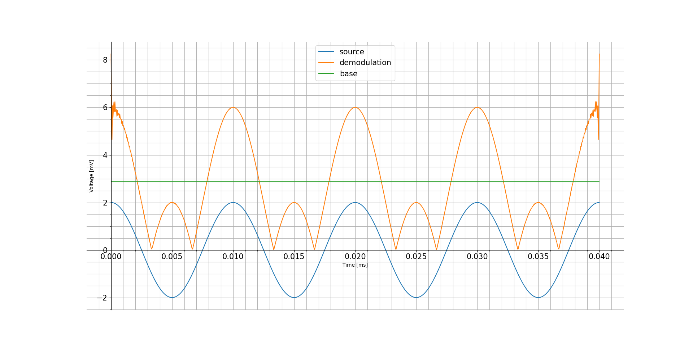

# AMPLITUDE MODULATION

## 振幅変調のシミュレーション

### 概要

信号源 $ v_{s}(t) $

$$ v_{s}(t) = A_{s} \cos(\omega_{s} t) $$

搬送波 $v_{c}(t) $

$$ v_{c}(t) = A_{c} \cos(\omega_{c} t) $$

このときの変調波 $ v_{AM}(t) $ は以下のようになる。

$$ v_{AM}(t) = ( A_{c} + A_{s} \cos(\omega_{s} t)) \cos(\omega_{c} t) $$

ここで変調度 $ m $ を定義すると
$$ m = \frac{A_{s}}{A_{c}} $$

$$ v_{AM}(t) = A_{c} ( 1 + m \cos(\omega_{s} t)) \cos(\omega_{c} t) $$

- $ 0 < m < 1 $ のとき

$$ m = 0.5 $$

$$ m = 1 $$

- $ m > 1 $ のとき

$$ m = 2 $$

変調波 $ v_{AM}(t) $ の包絡線が信号源 $ v_{s}(t) $である。まず半端清流回路を用いて $ v_{AM}(t) > 0 $ の範囲を取り出す。コンデンサを並列に接続して包絡線を検波する。
